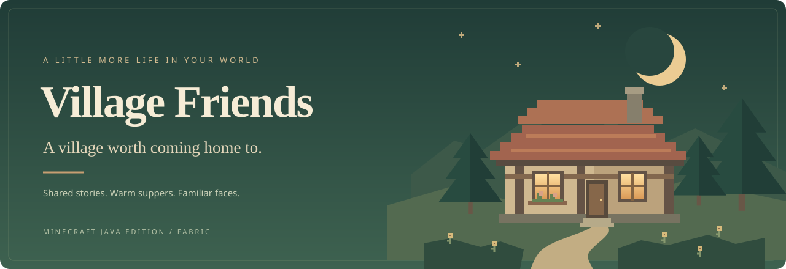
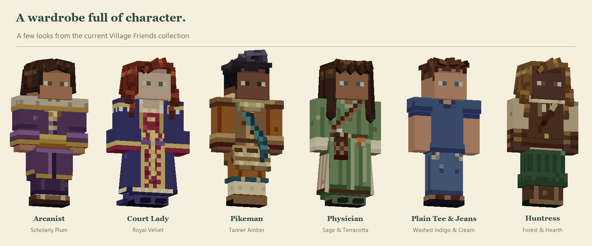

<div align="center">



# Village Friends

**A village worth coming home to.**

Names to remember. Stories to share. A little more life behind every door.


[](LICENSE)

[New character designs](#wardrobe) · [Village life](#village-life) · [Start playing](#installation) · [Friendship](#friendship) · [For makers](#development)

</div>

---

You arrive for a trade. You stay for the people.

**Village Friends** is a Fabric mod for Minecraft Java Edition that turns villages into communities with their own rhythms. Residents have names, personalities, families, favorite gifts, homes, and memories. They work, fall in love, raise children, adopt pets, quarrel, celebrate birthdays, and save you a place in their stories.

Drop by for a conversation. Bring something thoughtful. Help a neighbor, follow a winding street, or spend an evening at the tavern. Little visits become shared history.

*Conversations and personal stories work offline.*

<a id="wardrobe"></a>

## ✨ Meet the new village wardrobe

The current character designs bring **layered pixel-art outfits, sculpted hairstyles, expressive faces, and a much bigger wardrobe** to your village. From an apothecary's herb pouches to a court lady's embroidered gown, the little details give each silhouette its own character.



<p align="center"><sub>Wardrobe asset previews rendered from the current source. In-game faces are animated.</sub></p>

| A wardrobe to make their own | Hairstyles | Tops | Bottoms |
| :--- | ---: | ---: | ---: |
| **Men's collection** | 80 | 219 | 219 |
| **Women's collection** | 50 | 132 | 132 |

**Ten coordinated palettes** pull each outfit together, with ten natural hair colors and compatible pieces that mix across a resident's wardrobe. Non-binary residents draw from both collections. Casual medieval workwear, robes, aprons, armor, and festival clothes sit alongside a plain modern casual line for men.

Collars, cloaks, skirts, and hair have real depth. Soft eye highlights, individual blinking, tiny glances, swaying ponytails, and six walking styles bring the designs to life. Children have their own proportions and quicker little steps. Your neighbor's look and equipment carry through to their live conversation portrait.

<a id="village-life"></a>

## 🌿 A day in the village

| When you stop by… | There's a little life unfolding. |
| :--- | :--- |
| **Morning at home** | Families wake in their own houses. Early birds start their day; children head to lessons. A resident's cat curls up beside their bed. |
| **A busy afternoon** | Cooks prepare food, painters work at their easels, and carpenters use the sawmill. Children gather for tag, hide-and-seek, or a game of catch. |
| **One more errand** | The Notice Board has letters to deliver, supplies to find, and birthday surprises to help arrange. A good deed becomes something the neighbors talk about. |
| **Supper at the tavern** | Residents choose seats near friends and family. The keeper carries drinks, the cook serves dinner, and the bard gives everyone a reason to linger. |
| **After the sun goes down** | Families turn in while guard squads take the night watch. Beyond town, an old soldier still keeps watch from a lonely tower. |

Every resident keeps personal hours. Weather changes their plans, and every seventh day is **Market Day**. Speech bubbles, small gestures, individual walking styles, and thousands of authored dialogue lines make the everyday moments feel lived in.

<a id="friendship"></a>

## 💛 From hello to lifelong friend

Friendship grows through **ten levels**, from a new face to a lifelong friend. Learn what someone loves, listen to their four-chapter story, share a picnic, and show up on another day. Deeper friendships open through trust and shared experiences.

**12 personalities · 8 personal story arcs · 24 story requests**

The conversation window keeps your neighbor in view, with a live portrait, a parchment dialogue box, and numbered replies. Press **1–6** to answer; **Space** or a click finishes the current line.

| Open this tab | Make a little time for… |
| :--- | :--- |
| **Talk** | Everyday conversation, jokes, village news, and a thoughtful apology when you need one. |
| **Story** | A personal project, a confession, and a choice about what comes next. |
| **Journal** | Shared memories, favorite things, and the details that make this resident themselves. |
| **Time** | A walk, a picnic, an exploration, or a gathering with the neighbors. |
| **Travel** | An adventure together, equipment to exchange, and a safe return home. |

Hold an item and choose **Give gift** to offer it. Each resident accepts up to three gifts from you per Minecraft day; their favorites matter. Birthdays make a thoughtful gift even sweeter.

> There are no story-request deadlines and no friendship penalty for taking a break. Come back when you're ready.

## 🏡 A place with people in it

**Five village styles.** Discover timber-framed plains towns, sandstone desert oases, acacia-and-thatch savanna towns, snowy hamlets, and taiga log cabins. Procedural streets connect homes, workshops, farms, and a civic center with a tavern, garrison, chapel, apothecary, and library. New generation replaces vanilla villages; already explored chunks stay as they are.

**Homes that belong to someone.** Partners sleep side by side, children live with their parents, and each resident has a bed of their own. Put a **House Plaque** in a home you build and households needing room can move in. Mark it Private if you'd like to keep it for yourself.

**Families, friendships, and a little gossip.** Neighbors form friendships and rivalries. Romance between residents grows slowly; couples can marry and have children. The **Village Ledger** keeps track of the people, their relationships, homes, and village news.

**Birthdays worth remembering.** A four-season calendar gives everyone a birthday. Expect party hats, music, cake, and an evening celebration by the bell.

**Pets with people of their own.** Some residents befriend and name a stray cat or dog. Pets follow their person, nap near home, and play together. Right-click one to meet them, give a treat, or offer a pat.

**Life beyond the village.** Discover a farmstead, a shepherd's fold, a herbalist's cottage, an old watchtower, or the neglected home of an outcast. Each homestead has people whose conversation and routines fit the life they lead.

<p align="center"><em>A house becomes a home when you know who lives there.</em></p>

## 🧺 Plenty to lend a hand with

Ten new professions bring their own trades and workstations:

| Profession | Their corner of the village |
| :--- | :--- |
| ⚔️ Knight | Training Dummy |
| 🏹 Archer | Archery Target |
| 🍲 Cook | Kitchen Stove |
| ☕ Tavern Keeper | Drinks Barrel & Tap Stand |
| 🌱 Apothecary | Alchemical Press |
| 🎨 Painter | Easel Canvas |
| 🎵 Bard | Music Stand |
| 🧵 Tailor | Sewing Table |
| 🪵 Carpenter | Sawmill |
| 📚 Scholar | Archives |

These stations have things for you to do, too: cook a meal, pour a coffee, paint a canvas to take home, mend equipment, or copy the village chronicle. Each new profession also has five levels of trades.

Answer notices for supplies, deliveries, monster hunts, and celebrations. Your help earns rewards, friendship, and village standing. Residents remember kindness—and harm. Witnesses react, news travels, and the way you treat a community shapes its welcome and prices.

## 🗺️ Take a friend along

Earn a resident's trust and invite them on an **Overworld adventure**. One companion can travel with you at a time. Ask them to follow, wait, or return home; exchange equipment and help them up if they're downed.

Knights and Archers also defend their villages, patrol at night, and answer the alarm when a resident is attacked. Their saved combat progression reaches **level 50**, with equipment still playing an important part.

Ordinary residents can be knocked out by a fatal blow. **Smelling Salts**, **Revival Tonics**, and **Bandage Wraps** give you a chance to help before the recovery window closes. Untreated residents can die permanently; recruited companions have a separate, gentler recovery rule. See the [guard and rescue guide](GUARDS.md#knockouts) for the details.

<a id="installation"></a>

## 🌱 Make yourself at home

### What you'll need

| Requirement | This version targets |
| :--- | :--- |
| Minecraft Java Edition | **26.3** |
| Fabric Loader | **0.19.5 or newer** |
| Fabric API | **0.161.0+26.3** |
| Java | **64-bit Java 25** |

### Install

1. Set up a **Minecraft 26.3** instance with [Fabric Loader](https://fabricmc.net/use/installer/).
2. Add [Fabric API](https://modrinth.com/mod/fabric-api) for that Minecraft version to the instance's `mods` folder.
3. [Build Village Friends from source](#build-from-source), then copy `build/libs/village-friends-2.26.1.jar` into the same folder. Use the regular JAR, not the `-sources.jar`, and remove any older Village Friends JAR from that folder.
4. Launch the Fabric instance and **right-click an awake villager** to say hello.

For multiplayer, install Village Friends and its dependencies on **both the server and every client**. Each player builds their own friendships and memories; village names and community life are shared.

Upgrading from a version before **2.24**? Start a new world; the housing and deed systems do not migrate older saves.

### Your first afternoon

1. **Find a village.** Explore newly generated terrain. With commands enabled, use `/locate structure #minecraft:village`.
2. **Meet someone.** Ask about their day and take a look at their Story and Journal.
3. **Read the Notice Board.** Find a small way to help, and open the Village Ledger to meet the rest of town.
4. **Stay for supper.** Drop into the tavern—or come back with a gift tomorrow.

Building your own settlement? Place a **Village Marker**. Name it in an anvil before placing it to choose your village's name.

<details>
<summary><strong>A few useful things to know</strong></summary>

- **Vanilla trading:** choose Trade in conversation, or sneak-right-click a resident.
- **New villages and homesteads:** appear in newly generated chunks. Existing terrain is not rebuilt.
- **Find a homestead:** `/locate structure #villagefriends:homesteads`.
- **Activities:** unlock at 15 friendship points and 30 trust. Close the conversation to move; talk again and choose **Finish our outing** when you're done.
- **Companions:** require Friend status, the second story chapter, and 50 trust. Travel is limited to the Overworld; recruited companions cannot use portals.
- **Co-op story requests:** the resident's physical project is shared. The first supplier gets credit; other players keep their supplies and can build their own relationship.
- **Identity:** names, history, and relationships survive saving and reloading, and transfer through zombie conversion and curing.

</details>

## 📖 Explore a little deeper

| If you're curious about… | Open the guide |
| :--- | :--- |
| Families, relationships, and the Ledger | [Village life](VILLAGE_LIFE.md) |
| Daily routines and useful workstations | [Village days](VILLAGE_DAYS.md) |
| Supper, seating, and the bard's stage | [The tavern](TAVERN.md) |
| Parties, the calendar, and village requests | [Birthdays & notices](BIRTHDAYS_AND_NOTICES.md) |
| Cats, dogs, and children's games | [Pets](PETS.md) · [Playtime](PLAYTIME.md) |
| Housing and your reputation | [Homes](HOMES.md) · [Deeds](DEEDS.md) |
| Defense, combat levels, and rescue | [Guards](GUARDS.md) |
| People living out in the countryside | [Homesteads](HOMESTEADS.md) |

### A longer adventure, if you'd like one

[**Village Friends RPG**](rpg/README.md) is an optional companion mod in this repository. It adds 100 character levels, 10 attributes, 15 skills that improve with use, monster milestones, and resident jobs. It builds as a separate JAR; the base Village Friends mod works on its own.

<a id="development"></a>

## 🛠️ For the makers

<a id="build-from-source"></a>

### Build from source

Clone this repository and set `JAVA_HOME` to a **JDK 25** installation. From the project root:

```powershell
# Windows: package the mod and run unit tests
.\gradlew.bat build

# Optional RPG add-on
.\gradlew.bat :rpg:build

# Launch a development client
.\gradlew.bat runClient

# Run the in-game interaction and persistence checks
.\gradlew.bat runClientGameTest
```

On Linux or macOS, use `./gradlew` in place of `.\gradlew.bat` (run `chmod +x gradlew` if needed). The base mod is written to `build/libs/village-friends-2.26.1.jar`. Building does not install it into your launcher profile. See [verification notes](VERIFICATION.md) for recorded coverage and limitations.

**Make something that belongs here.** Buildings have independent blueprints, wardrobe pieces have individual source modules, and stories can be replaced through a data pack. Start with the [building guide](BUILDING_EDITING.md), [wardrobe guide](WARDROBE_EDITING.md), or [animation packs](ANIMATION_PACKS.md). The bundled [story content](src/main/resources/data/villagefriends/villagefriends/content.json) defines personalities, story arcs, requests, and their conditions.

To refresh the README wardrobe gallery from its source assets, run `python tools/render_readme_gallery.py` with Pillow and NumPy installed.

Found a bug or have an idea? [Open an issue](https://github.com/radhepa/Village-Friends-Minecraft-Mod/issues) with your mod version and what happened. For a bug, include steps to reproduce it and a relevant log excerpt.

---

<div align="center">

**Leave a little kindness in the village.**

*Someone might remember it tomorrow.*

[MIT licensed](LICENSE) · Original artwork · Made for Minecraft Java Edition

</div>
